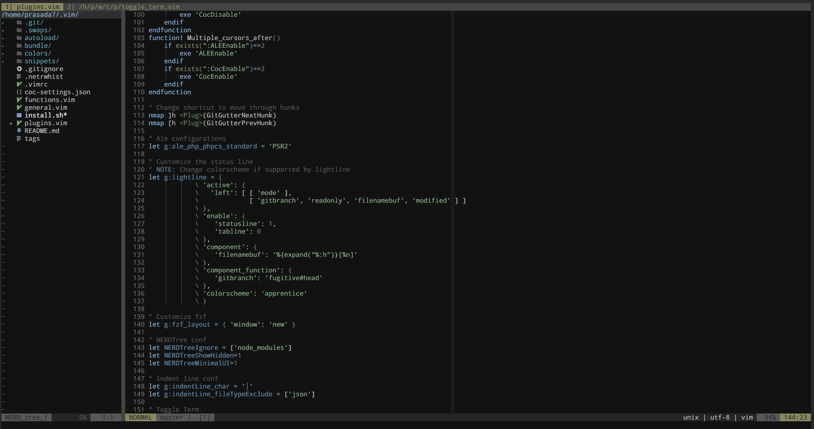

# toggleterm.vim



## Introduction
A simple plugin that extends Vim's terminal feature to make it toggle-able.

## Installation

Using plugin managers

<details>
  <summary>Vundle</summary>
  
 ```vim
 Plugin 'prasada7/toggleterm.vim'
 ```
</details>


<details>
  <summary>Vim-Plug</summary>
  
 ```vim
 Plug 'prasada7/toggleterm.vim'
 ```
</details>

## Mappings

To toggle the terminal on and off `<Plug>ToggletermToggle` is used. So, to add keybind to toggle the terminal, add the following:

```vim
" CTRL + \ is the default
nmap <silent> <C-Bslash> <Plug>ToggletermToggle
tmap <silent> <C-Bslash> <C-w><S-N><Plug>ToggletermToggle
```

## Customization

To change the height of the terminal

```vim
let g:toggle_term_height = 15 " 15 is the default
```

To disable the plugin

```vim
let g:loaded_toggle_term = 1
```
